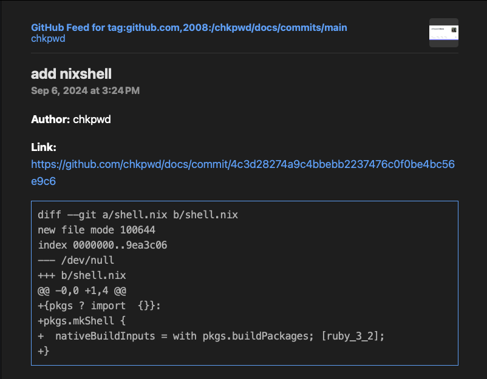

## Overview

Transform GitHub commits into a format that highlights the actual code
changes, allowing users to easily monitor updates in a traditional RSS reader
like Feedly or Miniflux.

## Functionality

1. Grabs an Atom feed from GitHub (https://github.com/:owner/:repo/commits.atom)
2. Parses all commits to obtain the diff
3. Generates an RSS feed for each commit, displaying the corresponding diff

## 📸 Shots


## Installation

### Docker
You can easily get started by pulling the latest image from GitHub Container Registry (GHCR):

```
docker pull chkpwd/diff2rss:latest &&
docker run -d \
  --name diff2rss \
  -p 8000:8000 \
  chkpwd/diff2rss:latest
```

Once you have the container installed, you're ready to go!

### Kubernetes
```yaml
apiVersion: apps/v1
kind: Deployment
metadata:
  name: diff2rss
spec:
  replicas: 1
  selector:
    matchLabels:
      app: diff2rss
  template:
    metadata:
      labels:
        app: diff2rss
    spec:
      containers:
      - name: diff2rss
        image: ghcr.io/chkpwd/diff2rss:latest
        ports:
        - containerPort: 8000
---
apiVersion: v1
kind: Service
metadata:
  name: diff2rss-service
spec:
  selector:
    app: diff2rss
  ports:
    - protocol: TCP
      port: 8000
      targetPort: 8000
  type: ClusterIP  # This keeps the service internal, the Ingress will expose it externally
---
apiVersion: networking.k8s.io/v1
kind: Ingress
metadata:
  name: diff2rss-ingress
  annotations:
    nginx.ingress.kubernetes.io/rewrite-target: /
spec:
  rules:
  - host: diff2rss.yourdomain.com  # Replace with your desired domain name
    http:
      paths:
      - path: /
        pathType: Prefix
        backend:
          service:
            name: diff2rss-service
            port:
              number: 8000
```
## Usage

### Add to your favorite RSS Reader

Open your preferred RSS reader and create a new subscription. The URL should be
in the following format:
``https://diff2rss.domain.tld/generate_rss?source=owner/repo``

Specifying the branch:
``https://diff2rss.domain.tld/generate_rss?source=owner/repo&branch``

### Manual Testing
```
curl -s -X GET https://diff2rss.domain.tld/generate_rss?source=owner/repo

```

#### Response
```xml
<?xml version="1.0" encoding="UTF-8"?>
<rss version="2.0" xmlns:dc="http://purl.org/dc/elements/1.1/">
  <channel>
    <title>GitHub Feed for Recent Commits to iac:main</title>
    <link>https://github.com/chkpwd/iac/commits/main</link>
    <description>Latest entries from GitHub repository</description>
  </channel>
</rss>
... # Removed for brevity
```
